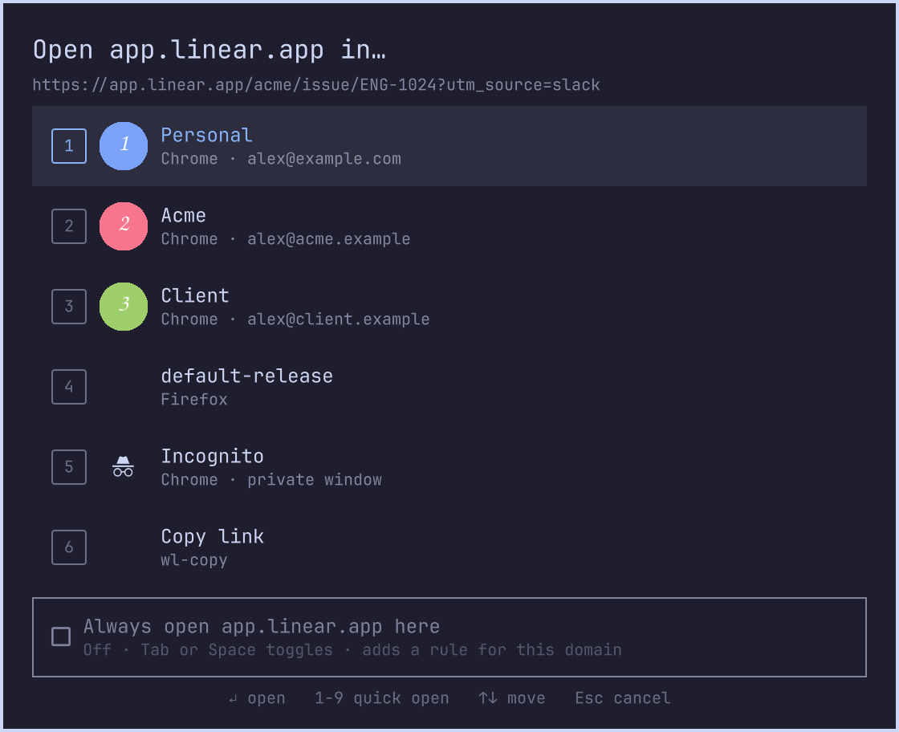

# browserhat

A browser profile picker for Omarchy, built as an Omarchy shell plugin.

If you keep separate browser profiles for personal, work, and client accounts, every link you click
outside a browser lands in whichever profile happens to be the default. Browserhat intercepts that
click and asks instead. An overlay lists your profiles across Chrome, Chromium, Brave, and Firefox,
with account avatars and hotkeys. Press `1`–`9` to open the link in that profile, `Tab` to remember
the choice for that domain so it never asks again, or `Esc` to drop the link.

Features:

- Profiles discovered automatically from the browsers' own profile lists, with Chrome avatars
- Rules that route matching URLs to a profile without showing the picker
- A one-key "always open this domain here" toggle that writes the rule for you
- Tracking parameters (`utm_*`, `fbclid`, `gclid`, …) stripped before the link opens
- Incognito and copy-to-clipboard as targets
- Falls back to Omarchy's built-in menu if the plugin is disabled



## Requirements

- Omarchy 4.x (the picker runs inside `omarchy-shell`; tested on 4.0.2 / Hyprland 0.56)
- At least one of: Google Chrome, Chromium, Brave, Firefox
- `jq`, `wl-copy` (both ship with Omarchy)

## Install

```sh
omarchy plugin add https://github.com/phiendp/browserhat.git
~/.config/omarchy/plugins/io.github.phiendp.browserhat/install.sh
```

The first command clones the plugin into the shell's plugin folder. The second enables it, symlinks
the `browserhat` script into `~/.local/bin`, and registers it as the default `http`/`https` handler
(`google-chrome-browserhat.desktop`). Nothing else on the system is modified.

Tip: Chrome will nag that it is no longer the default browser. Add `--no-default-browser-check` to
`~/.config/chrome-flags.conf` (and `chromium-flags.conf`) to silence it.

To remove:

```sh
~/.config/omarchy/plugins/io.github.phiendp.browserhat/uninstall.sh   # restores Chrome as default
omarchy plugin remove io.github.phiendp.browserhat
```

## How it works

```
click link ──► xdg-open ──► mimeapps.list ──► google-chrome-browserhat.desktop ──► browserhat <url>
                                                                                   │
                       ┌───────────────────────────────────────────────────────────┘
                       ▼
             strip tracking params ──► rules match? ──yes──► launch target, done
                       │ no
                       ▼
     omarchy-shell shell summon io.github.phiendp.browserhat '{url, targets[], selectionFile, doneFile}'
                       │                                  (overlay draws, user picks)
                       ▼
     poll doneFile ──► read "<target-id>\t<remember>" from selectionFile ──► maybe add rule ──► launch
```

The overlay never launches anything itself. It only answers the question and hands the answer back
through two temp files, the same contract Omarchy's own image picker uses. That keeps every
side effect (rules, launching, focusing) in the script, where it is easy to test with `browserhat test`.

## Plugin anatomy (what I learned building this)

```
io.github.phiendp.browserhat/
├── manifest.json        # id, kinds:["overlay"], entryPoints.overlay, keepLoaded
├── Browserhat.qml         # the overlay: PanelWindow on the Overlay layer + a BorderSurface card
├── BrowserhatModel.js     # pure helpers (payload parsing, hotkeys, selection line)
├── browserhat             # bash handler: discovery, rules, launching, summoning the overlay
├── google-chrome-browserhat.desktop
├── install.sh / uninstall.sh
└── README.md
```

**Discovery.** The shell's `PluginRegistry` scans `~/.config/omarchy/plugins/*/manifest.json`
(third-party) and `$OMARCHY_PATH/shell/plugins` (first-party). Folder name = plugin id. Third-party
ids must not start with `omarchy.`; the docs suggest `io.github.<you>.<name>`. Symlinks anywhere inside
the folder fail validation, so develop in place (or `cp -a` a checkout in).

**Enablement.** First-party plugins are on unless listed in `disabledPlugins`; third-party ones are
off until `omarchy plugin enable <id>` adds them to `shell.json`. `summon` on a disabled plugin
prints `unknown` and does nothing, which the script uses to fall back to `omarchy-menu-select`.

**Loading.** For every enabled `panel`/`overlay`/`menu` plugin the shell creates a `Loader`. It goes
active on the first `summon` (or at startup with `"keepLoaded": true`). After load the shell injects
`omarchyPath`, `shell`, and `manifest` into the root item if those properties exist, then calls
`open(payloadJson)` with the payload string from the summon.

**Contract.** The root QML item must expose `opened`, `open(payloadJson)`, `close()`, `toggle()`.
`shell.hide(id)` calls `close()`; the plugin should call `shell.hide(manifest.id)` when it dismisses
itself so the shell's open-state stays in sync. `omarchy-shell shell call <id> <method> <arg>` invokes
any other function on the root item, which is how the end-to-end test simulates a key press:
`omarchy-shell shell call io.github.phiendp.browserhat choose 1`.

**Theming.** `import qs.Commons` gives `Color`, `Style`, `Border`, `Util`; `import qs.Ui` gives
`BorderSurface` and friends. Reusing the `[menu]` tokens (`Color.menu.background`, `Style.font.menuFamily`,
`Style.cornerRadius`, …) makes the overlay follow whatever theme is active with no work.

**Writing files from QML.** Quickshell has no direct file write for arbitrary paths, so the overlay
runs a tiny `Process` (`bash -c "printf … > selectionFile; : > doneFile"`) with `Util.shellQuote`.

**Tooling.** `omarchy plugin validate <dir>` checks the manifest. `qmllint -I $OMARCHY_PATH/shell`
reports import warnings for `qs.*` even on the built-in plugins, so compare against a first-party
file rather than chasing zero warnings. Saving any file under `~/.config/omarchy/plugins/` reloads the
shell; `omarchy-shell shell rescanPlugins` forces it, and give it a few seconds before calling into the
new code. Screen-capture tools like `grim` can stall while a static overlay is up, so the overlay has
a dev helper that renders just the card from inside the shell:

```sh
omarchy-shell shell summon io.github.phiendp.browserhat "$payload"
omarchy-shell shell call   io.github.phiendp.browserhat snapshot /tmp/card.png   # how preview.png was made
omarchy-shell shell call   io.github.phiendp.browserhat choose 1                 # simulate pressing 2
omarchy-shell shell hide   io.github.phiendp.browserhat
```

## Configuration

| Path | Purpose |
|------|---------|
| `~/.config/browserhat/rules` | `<ERE regex>  <target-id>` per line, first match wins, target may contain spaces |
| `~/.config/browserhat/config` | optional bash overrides, see below |
| `~/.local/state/browserhat/last-target` | used only when the shell itself is down |

```sh
# ~/.config/browserhat/config
strip_tracking=true              # drop utm_*, fbclid, gclid, … before opening
offer_remember=true              # show the "Always open <host> here" toggle
webapp_target="chrome:Default"   # profile for Omarchy web apps (--app=URL); no picker
private_target="chrome:incognito" # target for --private launches (Super+Shift+Return); no picker
picker=auto                      # auto | plugin | menu
```

## CLI

```sh
browserhat https://…            # pick (or apply a rule) and open
browserhat list                 # discovered targets and their ids
browserhat rules                # edit rules in $EDITOR
browserhat add-rule '^https?://([^/]*\.)?atlassian\.net/' 'chrome:Profile 2'
browserhat test https://…       # which rule/target a URL resolves to, no launch
```

Targets are discovered from Chrome/Chromium/Brave `Local State` (with profile avatars) and Firefox
`profiles.ini`, so adding a profile in the browser makes it appear automatically.

## Omarchy integration notes

- `Super+Return` (`omarchy-launch-browser`) resolves the default browser → browserhat with no URL → picker → new window.
- `Super+Shift+Return` passes `--private` → Chrome incognito, no picker.
- Omarchy web apps pass `--app=URL` → `webapp_target`, no picker. The desktop file is named
  `google-chrome-browserhat.desktop` because `omarchy-launch-webapp` falls back to Chromium unless the
  default handler's name starts with `google-chrome`.

## Contributing

Issues and PRs welcome. Before opening a PR run `omarchy plugin validate .` and `bash -n browserhat`,
and try the flow once with `browserhat https://example.com`.

## License

MIT, see [LICENSE](LICENSE).
